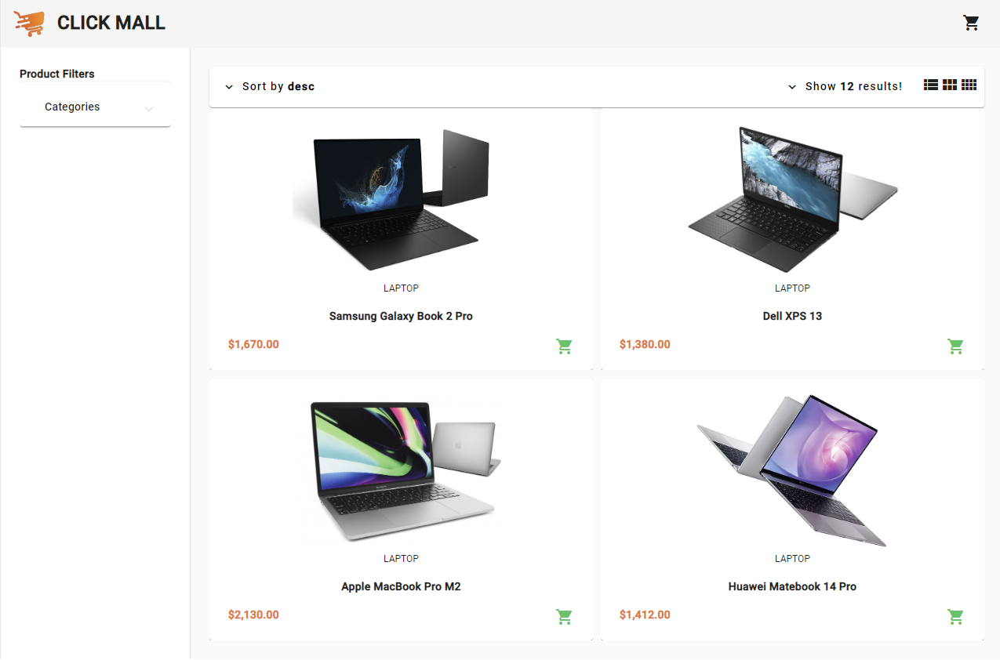

# <a href="https://github.com/githiomi/Click-Mall" target="_blank"></a> CLICK MALL

> Created by <a href="https://www.github.com/githiomi"> Daniel Githiomi </a>

## 🚧 Description

This project was created using [Angular CLI](https://github.com/angular/angular-cli) version 15.2.6.

`Click Mall` is a project developed using Node, Angular, Typescript, HTML5 and CSS. It is an online E-Commerce Store Application that allows a user to shop for products provided by the backend API.

## 👀 Product Preview



## 🏗️ Development server

Run `ng serve` for the development server. Navigate to __`http://localhost:4200/`__. The application will automatically reload if you change any of the source files.

## 🏁 App Configuration

Install dependencies

```` (nodejs)
npm install
````

Run Angular server __(http://localhost:4200)__

```(nodejs)
ng serve
```

Run the Stripe server __(http://localhost:4242)__

```(nodejs)
node stripe-server.js
```

## ⏬ Setup/Installation Minimal Requirements

You will need to have the following installed on your system for the application to run:

* Any Modern Browser.
* `Node JS` installed on your machine

Make sure to run the following command to get the `node_modules` folder added to your version.

```(nodejs)
npm init
```

You will also need to have a local server running to perform the cart checkout using the following command in the root directory.

```(nodejs)
node stripe-server.js
```

## ➕ Compatibility

Compatible with all mordern browsers.

## 🤖 Technologies & Resources Used

It is made entirely using Visual Studio Code in ollaboration with the Angular CLI to create all the files and to achieve the output as you see it.

* `Typescript` - Angular core language.
* `Angular` - Client-Side Frontend Framework.
* `Angular Material` - Angular Material library to help with component creation.
* `Fake Store API` - The backend used to store the products to be displayed on the website.
  * [Fake Store API](https://fakestoreapi.com/)
* `Font Awesome` - Provides SVG icons

```(nodejs)
ng add @fortawesome/angular-fontawesome
```

* `Stripe` - Provides the checkout protocol

```(nodejs)
npm install @stripe/stripe-js
```

## 🪲 Known Bugs

Only one bug to report at the moment! Else, the system works efficiently at 100% guaranteed.

1. `Stripe` is a payment system that only works with United States Registered Cards. This limits the ability of other countries to use this payment method.

> Cross platform support are under development using React.

> Other payment methods such as `PayPal` will be integrated soon!

## 🏗️ Setup Instructions

In order to enjoy the features of this application you will need to:

* Git clone [this](https://github.com/githiomi/Click-Mall) into your terminal to your
  desired directory.
* Open the project in an IDE of choice (Eg: Visual Studio Code).
* Run 'ng serve' to run the application on the development server.
* Enjoy the `Click Mall` Angular Application and Shop at will.

## 📧 Support and contact details

Contact me through any of the following:

* Slack: danielgithiomi
* Email: danielgithiomi@gmail.com
* Github: githiomi

## 📃 License

Click the following to access the license
page: [Click-Here](https://githiomi.github.io/Privacy-Policy/)

> Copyright (c) {2023} DhosioLux Co.
